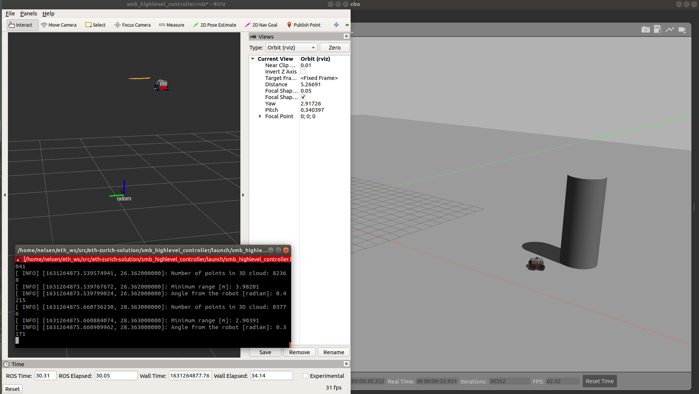

# ETH Zürich ROS Solution
This is an unofficial solution for [eth zurich ros](https://rsl.ethz.ch/education-students/lectures/ros.html) 2021 course for MLDA Robotics. The solution has been well tested for both ROS Melodic and Noetic.

The main solution package created for this is the `smb_highlevel_controller` which was created with the following command:

`catkin_create_pkg smb_highlevel_controller`

## Setup
As the exercise requires the use of ROS in gazebo simulation, it is assumed that the computer is properly setup with [`ros-melodic-desktop-full`](http://wiki.ros.org/melodic/Installation/Ubuntu) or [`ros-noetic-desktop-full`](http://wiki.ros.org/noetic/Installation/Ubuntu)  installation. Once ROS is installed, you can run the following command to create a Catkin workspace:

``` bash
sudo apt-get install python3-catkin-tools
mkdir -p catkin_ws/src
cd ~/catkin_ws
catkin build

# Automatically source setup.bash for convenience.
echo "source ~/catkin_ws/devel/setup.bash" >> ~/.bashrc
source ~/.bashrc
```

This ROS stack requires some dependencies which can be installed with the following command:

``` bash
sudo apt install -y ros-<distro>-hector-gazebo-plugins \
                    ros-<distro>-velodyne \
                    ros-<distro>-velodyne-description \
                    ros-<distro>-velodyne-gazebo-plugins \
                    ros-<distro>-pointcloud-to-laserscan \
                    ros-<distro>-twist-mux
```
where `<distro>` can be either melodic or noetic.

Once everything is fully setup, you can clone the package into the `catkin_ws/src` directory and build the entire package:
``` bash
cd ~/catkin_ws/src
git clone https://github.com/NelsenEW/eth-zurich-solution
cd ..
catkin build
```

## [Exercise 1](<docs/exercise/Exercise Session 1.pdf>)
This exercise is based on [lecture 1](<docs/lecture/ROS Course Slides Course 1.pdf>).

Run the launch file with the following command:

`roslaunch smb_highlevel_controller smb_highlevel_controller.launch`

### Output

||
|:--:|
| <b>Gazebo with SMB and teleop twist keyboard</b>|

#### Command line
* To control smb robot in gazebo through command line (press tab for autocompletion):

    `rostopic pub /cmd_vel geometry_msgs/Twist '[0.5,0,0]' '[0,0,0]'`
#### [smb_highlevel_controller.launch](smb_highlevel_controller/launch/smb_highlevel_controller.launch)
* The world file argument is hardcoded as follow:

    `<arg name="world_file" value="/usr/share/gazebo-9/worlds/robocup14_spl_field.world"/>`
* To launch the teleop keyboard in a new terminal, set the `launch-prefix` to `xterm -e`


## [Exercise 2](<docs/exercise/Exercise Session 2.pdf>)
This exercise is based on [lecture 2](<docs/lecture/ROS Course Slides Course 2.pdf>).

Run the launch file with the following command:

`roslaunch smb_highlevel_controller smb_highlevel_controller.launch`

The solution package template is based on [ros_best_practices](https://github.com/leggedrobotics/ros_best_practices)

### Output
The solution output should be as follow:
||
|:--:|
| <b>Rviz with laserscan, terminal with output and gazebo</b>|

##### pointcloud_to_laserscan
|

As can be seen from the `rqt_graph`, the `pointcloud_to_laserscan` node is subscribing to `/rslidar_points` which is a `PointCloud2` message and `/tf` and converts it into a `LaserScan` topic `/scan`.

### Files
#### [default_parameters.yaml](smb_highlevel_controller/config/default_parameters.yaml): 
* consist of parameters that are passed to the launch file.

#### [SmbHighlevelController.hpp](smb_highlevel_controller/include/smb_highlevel_controller/SmbHighlevelController.hpp): 
* Header file for **SmbHighlevelController** class and method declaration.
* Include `roscpp` and `sensor_msgs` that are used in the executable file.

#### [smb_highlevel_controller_node.cpp](smb_highlevel_controller/src/smb_highlevel_controller_node.cpp):
* Create a ROS node with private node handler `(~)`.
#### [SmbHighlevelController.cpp](smb_highlevel_controller/src/SmbHighlevelController.cpp): 
* Implementation of the class method including fetch parameters from launch
* Subscribe to topics name based on the parameters
* Implementation of callback method such as `scanCallback` and `pclCallback`.

#### [smb_highlevel_controller.rviz](smb_highlevel_controller/rviz/smb_highlevel_controller.rviz): 
* contains rviz file format which were created by running rviz seperately, adding the required display, and saving it into the rviz file.

#### [smb_highlevel_controller.launch](smb_highlevel_controller/launch/smb_highlevel_controller.launch):

* Add `<rosparam>` to load [default_parameters.yaml](smb_highlevel_controller/config/default_parameters.yaml) to parameter server.
* Add `node` to launch the [smb_highlevel_controller_node](smb_highlevel_controller/src/smb_highlevel_controller_node.cpp) script.

#### [CMakeLists.txt](smb_highlevel_controller/CMakeLists.txt):
* Use `C++11` with `add_compile_options`
* Add `find_package` to find libraries such as `roscpp` and `sensor_msgs`.
* Add `catkin_package` to include `INCLUDE_DIRS`.
* Define the include directories using `include_directories`.
* Add executable based on the project name from two different files which are [smb_highlevel_controller_node.cpp](smb_highlevel_controller/src/smb_highlevel_controller_node.cpp) and [SmbHighlevelController.cpp](smb_highlevel_controller/src/SmbHighlevelController.cpp)
* Link the libraries based on the `catkin_LIBRARIES` which is defined on the top.

#### [package.xml](smb_highlevel_controller/package.xml)
* Add `depend` for the dependencies which are `roscpp`, `sensor_msgs` and `smb_gazebo`
## [Exercise 3](<docs/exercise/Exercise Session 3.pdf>)
**Note: Change `smb_common` package to `smb_common_v2` package**

This exercise is based on [lecture 3](<docs/lecture/ROS Course Slides Course 3.pdf>).

Run the launch file with the following command:

`roslaunch smb_highlevel_controller smb_highlevel_controller.launch`

### Output
The solution output should be as follow:
||
|:--:|
| <b>Rviz with marker visualization indicate with the green color ball and tf marker, terminal with printed output such as the angle , and smb is heading towards the pillar in gazebo</b>|

### Files
#### [CMakeLists.txt](smb_highlevel_controller/CMakeLists.txt) and [package.xml](smb_highlevel_controller/package.xml):
* Add dependencies such as `geometry_msgs`, `tf2_ros`, and `visualization_msgs` package.

#### [SmbHighlevelController.cpp](smb_highlevel_controller/src/SmbHighlevelController.cpp) and [SmbHighlevelController.hpp](smb_highlevel_controller/include/smb_highlevel_controller/SmbHighlevelController.hpp):

* Include `geometry_msgs`, `tf2_ros`, and `visualization_msgs` package.
* Add two publisher for topics `visualization_marker` and `cmd_vel` during initialization.
* Create a `goalPose` of type `geometry_msgs::PoseStamped` which is the pillar from the lidar reading with respect to the `rslidar` frame.
* Create TF listerner and TF buffer to transform the `goalPose` from the `rslidar` frame to `odom` on `transformOdom`.
* Utilize a P controller from the error angle to drive the error to zero on `moveToGoal`, the x velocity is set to constant without P controller to ensure that the SMB hits the pillar.
* Publish a visualization marker on `visMarkerPublish` that can be displayed in Rviz.

#### [smb_highlevel_controller.launch](smb_highlevel_controller/launch/smb_highlevel_controller.launch):
* Change the world argument value to `"$(find smb_highlevel_controller)/world/singlePillar.world"`
* Add two arguments under `laser_scan_min_height` and `laser_scan_max_height` to -0.2 and 1.0 respectively.
* Remove the `teleop_twist_keyboard` node from the launch.

#### [smb_highlevel_controller.rviz](smb_highlevel_controller/rviz/smb_highlevel_controller.rviz):
* Add `Marker` display to visualize the pillar marker indicated with green color ball.
